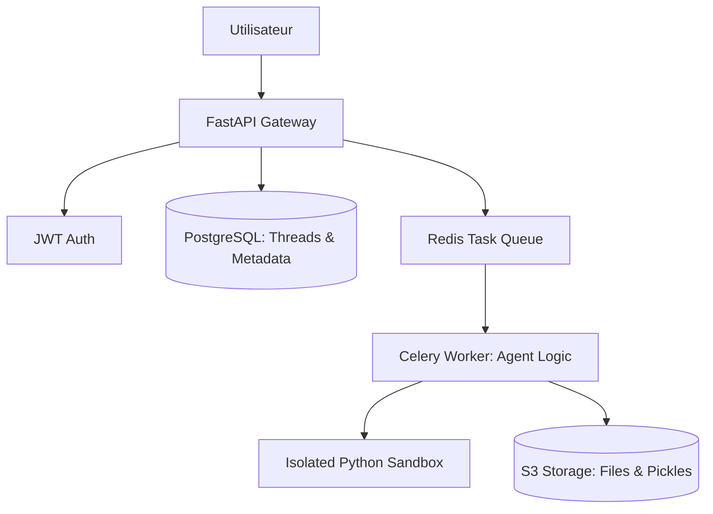

# Analyse d'Architecture : POC Actuel vs Système de Production Cible

## Résumé Exécutif
Le Proof of Concept (POC) actuel démontre une capacité réelle à analyser des données via un agent intelligent. Cependant, l'architecture monolithique actuelle présente des limites critiques pour un déploiement à grande échelle. Pour passer en production, nous préconisons une transition vers une architecture distribuée basée sur **FastAPI**, une persistance robuste via **PostgreSQL** et une exécution asynchrone des tâches via **Celery**.

## Analyse des Problèmes Actuels

### Problème 1 : Amnésie au Redémarrage
- **Découverte** : Lors de nos tests (Tâche 1.1), chaque rafraîchissement ou redémarrage du serveur entraînait la perte de l'historique de chat et des variables d'état.
- **Cause Racine** : L'état est stocké dans la mémoire vive (`st.session_state`), qui est volatile.
- **Impact Métier** : Expérience utilisateur médiocre nécessitant de répéter les instructions, augmentant les coûts opérationnels et la consommation de tokens LLM.
- **Solution Proposée** : Utilisation d'un `Checkpointer` persistant avec **PostgreSQL** pour sauvegarder l'état des threads de l'agent.

### Problème 2 : Fuite de Données Multi-Utilisateurs
- **Découverte** : Les répertoires de stockage (`uploads/` et `pickle/`) sont partagés globalement par toutes les sessions.
- **Cause Racine** : Absence d'isolation des données et de système d'authentification des utilisateurs.
- **Impact Métier** : Risque critique de sécurité et de non-conformité RGPD. Un utilisateur pourrait accéder aux données sensibles d'un autre.
- **Solution Proposée** : Authentification **JWT** et isolation des répertoires de fichiers par identifiant utilisateur (ID).

### Problème 3 : Sécurité de l'Exécution de Code
- **Découverte** : L'agent exécute du code Python généré par l'IA via la commande `exec()` dans l'outil `python_repl`.
- **Cause Racine** : Le code est exécuté directement sur le serveur hôte sans aucune isolation (sandbox).
- **Impact Métier** : Risque d'injection de code malveillant capable d'effacer des données serveur ou de voler des secrets d'environnement.
- **Solution Proposée** : Exécution du code dans des conteneurs **Docker** éphémères et isolés.

### Problème 4 : Goulot d'Étranglement (Scalabilité)
- **Découverte** : L'interface utilisateur Streamlit se bloque complètement pendant que l'agent génère des analyses complexes.
- **Cause Racine** : Modèle d'exécution synchrone bloquant le thread principal du serveur web.
- **Impact Métier** : Incapacité à gérer une montée en charge (plus de 2-3 utilisateurs simultanés).
- **Solution Proposée** : Architecture de file d'attente asynchrone avec **Celery** et **Redis**.

### Problème 5 : Volatilité de l'Analyse
- **Découverte** : La perte ou la corruption de fichiers `.pickle` entraîne des erreurs fatales (`GraphRecursionError`).
- **Cause Racine** : Dépendance forte entre la logique de l'agent et le système de fichiers local non indexé.
- **Impact Métier** : Instabilité du service et perte de rapports stratégiques déjà facturés à l'utilisateur.
- **Solution Proposée** : Stockage d'objets (S3) et base de données pour indexer les actifs générés.

## Architecture Cible Proposée

### Diagramme de l'Architecture

### Décisions Techniques Clés

| Composant | Choix Technique | Raison Principale |
| :--- | :--- | :--- |
| **Backend** | FastAPI | Haute performance, support natif de l'asynchrone et documentation OpenAPI. |
| **Persistance** | PostgreSQL | Robustesse pour la gestion des fils de discussion et compatibilité avec LangGraph. |
| **Async** | Celery / Redis | Gestion efficace des tâches longues sans bloquer l'expérience utilisateur. |
| **Authentification** | JWT | Standard sécurisé pour une architecture micro-services "stateless". |
| **Sécurité** | Sandbox Docker | Isolation totale des processus d'exécution de code Python. |    

## Analyse des Choix Techniques (Partie 2)

### 1. Architecture Backend : FastAPI vs Streamlit

**Pourquoi FastAPI au lieu de garder Streamlit comme backend ?**
Streamlit est un framework conçu pour le prototypage rapide d'interfaces utilisateur ("Frontend-as-Code"). Il n'est pas optimisé pour servir d'API robuste. 
- **Limites de Streamlit** : Il manque de gestion native pour les routes REST (GET, POST, etc.), les middlewares complexes, et la validation de données (Pydantic). De plus, chaque interaction utilisateur peut déclencher une réexécution du script, ce qui est inefficace pour un backend.
- **Mise à l'échelle horizontale** : FastAPI est nativement asynchrone et "stateless". On peut facilement multiplier les instances du serveur derrière un Load Balancer. Comme le serveur ne garde pas de données en mémoire vive locale entre les requêtes, n'importe quelle instance peut répondre à n'importe quel utilisateur.
- **Stateful vs Stateless** : 
    - **Stateful (avec état)** : Le serveur conserve des informations sur la session utilisateur (ex: Streamlit avec `session_state`). Si le serveur tombe, la session est perdue.
    - **Stateless (sans état)** : Le serveur ne stocke rien. Chaque requête contient tout le nécessaire (ex: Token JWT) pour être traitée. C'est la clé de la scalabilité moderne.

### 2. Sécurité et Connectivité : Le Middleware CORS

**Pourquoi un middleware CORS ?**
CORS (*Cross-Origin Resource Sharing*) est un mécanisme de sécurité implémenté par les navigateurs. Il empêche un script provenant d'une origine (ex: `localhost:8501`) d'accéder à des ressources d'une autre origine (ex: `localhost:8000`) sans permission.
- **Sans configuration CORS** : Le navigateur bloquera les requêtes HTTP du frontend vers le backend, affichant une erreur de sécurité, même si le serveur fonctionne bien.
- **En production, faut-il autoriser `origins=["*"]` ?**
    - **Non**. Utiliser l'astérisque `*` autorise n'importe quel site web malveillant à effectuer des requêtes sur votre API depuis le navigateur d'un utilisateur. 
    - **Solution** : On doit définir une "Whitelist" (liste blanche) contenant uniquement l'URL officielle de notre frontend.

### 3. Observabilité : Logging Structuré

**Pourquoi le logging structuré au lieu de print() ?**
Le `print()` envoie simplement du texte dans la console. C'est illisible et inexploitable à grande échelle.
- **Débogage en production (1000 req/min)** : Avec un tel volume, il est impossible de lire les logs à l'œil nu. On utilise des agrégateurs (comme ELK ou Datadog). Le logging structuré permet de filtrer instantanément par `request_id`, par `user_id` ou par niveau d'erreur (`ERROR`, `INFO`).
- **Pourquoi le format JSON ?** - Le JSON est "machine-readable". Il permet aux outils d'analyse de parser automatiquement les champs sans avoir à écrire des expressions régulières (Regex) complexes. On peut ainsi générer des alertes automatiques si le temps de réponse moyen dépasse un certain seuil.

# 🔐 Synthèse Sécurité : Authentification & Autorisation

## 1. Hachage des Mots de Passe
* **Concept :** Transformation irréversible (fonction à sens unique). On ne stocke jamais le texte clair, uniquement une empreinte (hash).
* **Résilience aux fuites :** Si la base de données est compromise, l'attaquant ne récupère que des hashs. Sans le mot de passe original, il ne peut pas usurper l'identité des utilisateurs.
* **Algorithmes :**
    * **Recommandés (Lents) :** `bcrypt` (utilisé ici) ou `Argon2`. Leur lenteur volontaire rend le "brute-force" mathématiquement trop coûteux.
    * **À Proscrire :** `SHA256` ou `MD5`. Trop rapides, ils permettent de tester des milliards de combinaisons par seconde.
* **Test du Hash :** S'authentifier avec un hash échoue systématiquement. Le système hacherait la chaîne du hash, produisant une empreinte totalement différente de celle en base.

## PARTIE 2. Tokens JWT (JSON Web Tokens)
* **Expiration :** Un JWT agit comme un badge d'accès temporaire. L'expiration (`exp`) limite la durée de validité si le token est intercepté.
* **Risque des tokens permanents :** Un token sans expiration est une "clé maîtresse" éternelle. En cas de vol, l'attaquant a un accès illimité tant que la `SECRET_KEY` du serveur n'est pas réinitialisée.
* **Durées Standards :**
    * **Access Token :** 15 min à 1 heure (usage immédiat, durée courte pour limiter les risques).
    * **Refresh Token :** 7 à 30 jours (permet de renouveler l'accès sans ressaisir les identifiants).
* **Gestion du Refresh :** En production, on utilise un Access Token (stocké en mémoire) et un Refresh Token (stocké dans un cookie sécurisé `HttpOnly`) pour combiner sécurité maximale et expérience utilisateur fluide.

# 🤖 2.4 Spécifications de l'Agent d'Analyse

Cette section définit les responsabilités et l'architecture logique de l'agent intelligent intégré au backend. L'agent n'est pas un simple script statique, mais une entité capable de raisonner pour manipuler des données complexes.

---

### 🎯 Objectifs et Capacités
L'agent est conçu pour couvrir l'intégralité du cycle de vie d'une analyse de données :

1. **Exploration & Description :** - Identification automatique des structures de données (colonnes, types).
   - Génération de statistiques descriptives pour offrir une vue d'ensemble immédiate du dataset.
2. **Nettoyage Automatisé (Data Cleaning) :**
   - Détection et traitement des valeurs manquantes (`NaN`).
   - Suppression des doublons et conversion intelligente des types de données (ex: transformer une chaîne en date).
3. **Visualisation Interactive :**
   - Création de graphiques via la bibliothèque **Plotly**.
   - Support de plusieurs formats : histogrammes pour la distribution, nuages de points pour les corrélations, et séries temporelles.
4. **Analyse Statistique :**
   - Calcul de matrices de corrélation.
   - Extraction de tendances significatives au sein des données.
5. **Exécution de Code Python (Sandbox) :**
   - Capacité à générer et exécuter du code `pandas` et `numpy`.
   - **Sécurité :** L'exécution se fait dans un environnement restreint (bac à sable) pour empêcher toute interaction non autorisée avec le système hôte.

---

###  Architecture du Raisonnement (Workflow)
L'agent suit une boucle logique de type **ReAct** (Reason + Act) :

* **Thought (Pensée) :** L'agent analyse la demande utilisateur et planifie les étapes (ex: "Je dois d'abord nettoyer la colonne 'Prix' avant de calculer la moyenne").
* **Action :** Génération du code Python spécifique à l'étape.
* **Observation :** Analyse du résultat renvoyé par l'interpréteur (données ou message d'erreur).
* **Final Answer :** Synthèse des résultats en langage naturel pour l'utilisateur.

---

### Stack Technique de l'Agent
| Composant | Technologie | Rôle |
| :--- | :--- | :--- |
| **Moteur LLM** | OpenAI / Anthropic / Local | Cerveau décisionnel et génération de code. |
| **Traitement de données** | `Pandas`, `Numpy` | Manipulation des DataFrames. |
| **Visualisation** | `Plotly` | Rendu graphique haute qualité. |
| **Interface API** | `FastAPI` | Communication entre l'utilisateur et l'agent. |